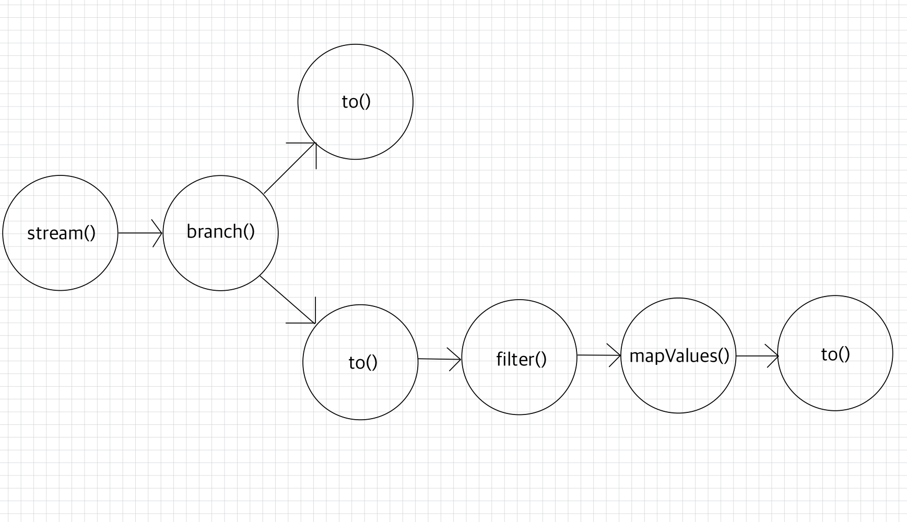

토폴로지 구조는 다음과 같다.    
  

<br>

각 토폴로지에서 사용하는 스트림즈 메서드는 다음과 같다.  
  


<br>

메트릭비트가 보낸 JSON 데이터의 구조는 다음과 같다.
```json
{
  "@timestamp": "2025-12-22T01:36:59.286Z",
  "metricset":
  {
    "name": "cpu",
    "period": 10000
  },
  "system":
  {
    "cpu":
    {
      "total":
      {
        "pct": 0.5398,
        "norm":
        {
          "pct": 0.09
        }
      },
      ...
    }
  },
  "host":
  {
    "name": "pipelineui-iMac.local"
  },
  ...
}
```